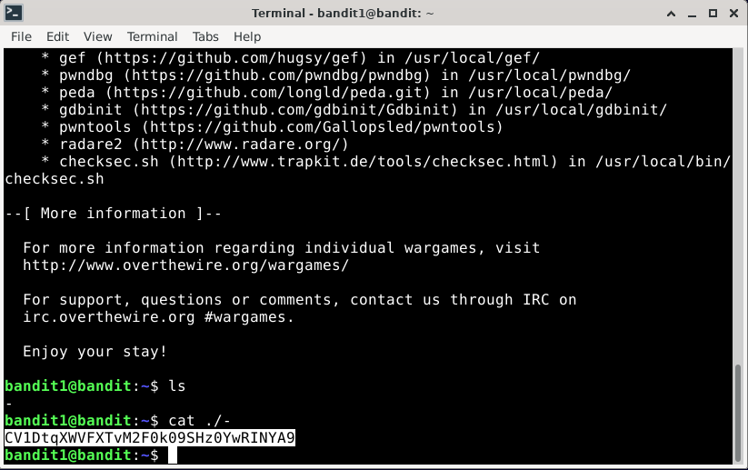
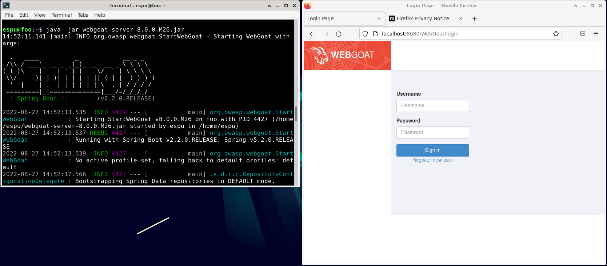
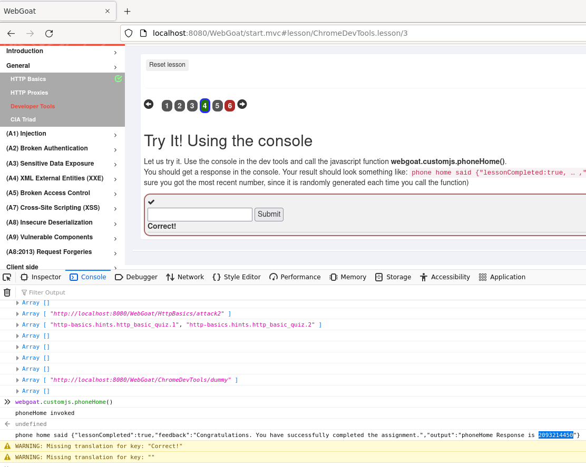

<h1> h1 </h1>

<h2> x) Read & sum</h2>

<h3> 
Hutchins et al 2011: Intelligence-Driven Computer Network Defense Informed by Analysis of Adversary Campaigns and Intrusion Kill Chains, chapters Abstract, 3.2 Intrusion Kill Chain and 3.3 Courses of Action
</h3>
<h6> Reference: https://lockheedmartin.com/content/dam/lockheed-martin/rms/documents/cyber/LM-White-Paper-Intel-Driven-Defense.pdf </h6>

  
  - Network defense tools like AV and intrusion detection systems work based on the assumption that there has already been a successful intrusion and therefore react based on suspicious behavior.

  - The threat actors' approach has evolved and become more sophisticated.

  - The Advanced Persistent Threat (APT) is a new threat that targets sensitive data using advanced tools and techniques that cannot easily be stopped by traditional defense tools.

  - Kill chain models are used by defenders to detect and mitigate vulnerabilities as well as achieve resilience against attackers by understanding the systematic processes or phases that an attacker follows to achieve his objective.

  - Kill chain models consist of:

     1. Reconnaissance: Identification and research of potential targets

     2. Weaponization: Preparation of an deliverable payload (an weaponized deliverable) through the use of exploits

     3. Delivery: Transmission of the weaponized deliverable by APT actors through different ways like email attachments, websites, or USB devices

     4. Exploitation: After a successful delivery, the attacker's payload is triggered and executed by the exploit

     5. Installation: The attacker establishes persistence in the target environment by installing the backdoor or remote access trojan

     6. Command and Control: Connection to a C2 channel is established through an outbound beacon, which allows for "hands-on" interaction by the attacker

     7. Actions on Objectives: The main objectives, like extracting data, encryption, or other, begin

  - The Course of Action Matrix shows what actions an individual can take to detect, deny, disrupt, degrade, deceive, and destroy processes of the kill chain

<h3> Karvinen 2020: Command Line Basics Revisited </h3>
<h6> Reference: https://terokarvinen.com/2020/command-line-basics-revisited/ </h6>

I have previous experience with the command line in Linux, 
but a recap of basic commands can never hurt.

  
<h5> Navigation: </h5>

pwd -> prints current directory

ls -> lists files that are within the current directory

cd -> change the directory

cd .. -> return to higher directory

<h5> File manipulation: </h5>

nano file.txt -> open file in a text editor

mkdir -> create a new directory

mv -> move or rename a directory

rmdir -> remove a directory

rm -> remove files

cp -r original copy -> copy files or directories

find -> locate files

<h5> Help: </h5>

man -> to show manual of a specific command

ls --help -> builtin manual

wget -h -> builtin manual

The list goes on..

<h2> a) Bandit oh-five. Over The Wire: Bandit (0-4) </h2>
<h6> Reference: https://overthewire.org/wargames/bandit/ </h6>

<h5> 0 → 1 </h5>

<h5> 1 → 2 </h5>

<h5> 2 → 3 </h5>

<h5> 3 → 4 </h5>

<h5> 4 → 5 </h5>

<h2>Addition</h2>

<h3> m) Voluntary: Banditry. Over the Wire: Bandit (5-7) </h3>

<h5> 5 → 6 </h5>

<h5> 6 → 7 </h5>

<h5> 7 → 8 </h5>

  

<h2> b) Bullseye. Install Debian 11-Bullseye virtual machine in VirtualBox. </h2>

<h3> Karvinen 2021: Install Debian on VirtualBox </h3>
<h6> Reference: https://terokarvinen.com/2021/install-debian-on-virtualbox/ </h6>

<h5> Setting up Debian </h5>

  - Install VirtualBox
  
  - Download the non-free live iso of Debian
  
  - Follow the guide to install Debian on Virtualbox
 
  - Update the system with either sudo apt-get update or sudo apt-get -y dist-upgrade
  
  - Install a firewall with sudo apt-get -y install ufw and sudo ufw enable
  
  - Install guest additions for a better screen resolution

<h6> Process </h6>

  

<h2> c) WebGoat. Install WebGoat practice target. </h2>

<h3> Karvinen 2021: Install Webgoat 8 - Learn Web Pentesting </h3>
<h6> Reference: https://terokarvinen.com/2020/install-webgoat-web-pentest-practice-target/</h6>

<h5> To prepare use: </h5>
  
  - sudo apt-get update
  
  - sudo apt-get -y install openjdk-11-jre ufw wget bash-completion

<h5> To install and start WebGoat use: </h5>

  - wget https://github.com/WebGoat/WebGoat/releases/download/v8.0.0.M26/webgoat-server-8.0.0.M26.jar
  
  - java -jar webgoat-server-8.0.0.M26.jar
  
  - http://localhost:8080/WebGoat/

<h6> Process </h6>

<h2> d) Hacker warmup on WebGoat </h2>

<h3> General: HTTP Basics </h3>

<h3> General: Developer tools </h3>

<h2> Additions in the future </h2>

n) Voluntary bonus: My fundaments. What do you consider the fundamentals of security? What would you teach the first day?

o) Voluntary bonus: Johnny Tables. Solve Webgoat: A1 Injection (intro).
