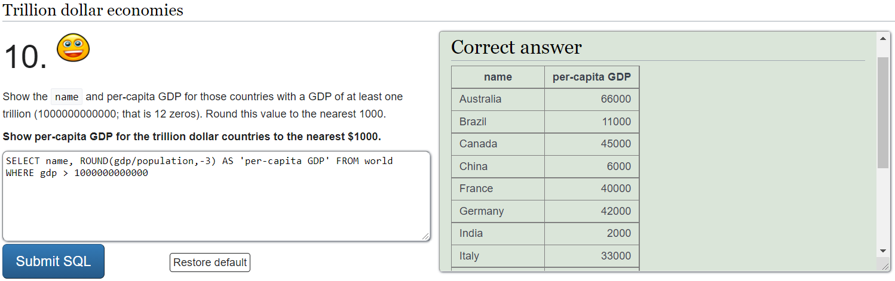
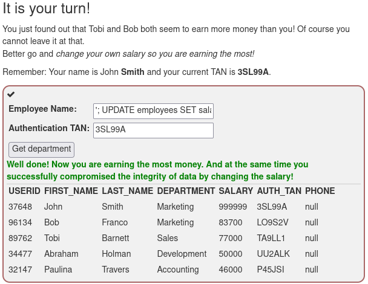

<h1> h2 </h1>

<h2> x) Read & sum</h2>

<h3> 
OWASP: OWASP 10 2021
</h3>

<h4>
Security Misconfiguration
</h4>
<h6> Reference: https://owasp.org/Top10/A05_2021-Security_Misconfiguration/ </h6>

  
 - ...

<h4> 
Vulnerable and Outdated Components
</h4>
<h6> Reference: https://owasp.org/Top10/A06_2021-Vulnerable_and_Outdated_Components/ </h6>

  
 - ...

<h4> 
Injection
</h4>
<h6> Reference: https://owasp.org/Top10/A03_2021-Injection/ </h6>

  
 - A code injection technique used to modify or retrieve data from SQL databases by sending statements that are not validated, filtered, or sanitized by the server or application.
  
 - Common injection targets are SQL, NoSQL, OS command, Object Relational Mapping (ORM), LDAP, and Expression Language (EL) or Object Graph Navigation Library (OGNL)
  
 - Prevention requires keeping data separate from commands and queries, as well as automated testing of all parameters, headers, URL, cookies, JSON, SOAP, and XML data inputs by using server-side input validation, API's that avoid the use of interpreters, limiting the amount of data that can be requested or other
  
 - Application security testing tools like static (SAST), dynamic (DAST), and interactive (IAST) can be used in the CI/CD pipeline to identify flaws before they are deployed

<h3> 
Darknet Diaries - Episode ...
</h3>
<h6> Reference: https://darknetdiaries.com </h6>

  
 - ...

<h3> 
CVE- ...
</h3>
<h6> Reference: ... </h6>

  
 - ...

<h2> a) Sequel. SQLZoo </h2>

<h3> 0 SELECT Basics </h3>
<h6> Reference: https://sqlzoo.net/wiki/SELECT_basics </h6>

  - ...

<h3> 2 SELECT from World </h3>
<h6> Reference: https://sqlzoo.net/wiki/SELECT_from_WORLD_Tutorial </h6>

  - ...

<h2> b) Injected. Solve WebGoat </h2>
<h6> Reference: https://github.com/WebGoat/WebGoat </h6>

<h3> A1 Injection </h3>

<h4>
Number 2 - SQL
</h4>

  - To retrieve data of the employee use: 
    - SELECT department FROM Employees WHERE first_name = 'Bob'

<h4>
Number 3 - Data Manipulation Language (DML)
</h4>
  
  - DML is used to manipulate data or request a set of records from the database by using SQL statements like SELECT, INSERT, UPDATE, or other
  
  - To change the department of the employee use: 
    - UPDATE Employees SET department = 'Sales' WHERE first_name = 'Tobi' AND last_name = 'Barnett'

<h4>
Number 4 - Data Definition Language (DDL)
</h4>
  
  - DDL is used to define, alter or delete data structures by using SQL statements like CREATE, ALTER or DROP

  - To modify the table use: 
    - ALTER TABLE Employees ADD phone VARCHAR(20)

<h4>
Number 5 - Data Control Language (DCL)
</h4>
  
  - DCL is used to create privileges to allow access to, or manipulate databases by using SQL statements like GRANT or REVOKE

  - To grant rights to alter the table use: 
    - GRANT ALTER TABLE TO UnauthorizedUser

<h4>
Number 9 - String SQL injection
</h4>
  
  - SQL injection is accomplished by inserting malicious code through the SQL query input from the client to the application

  - To exploit the concatenated strings in the query use: 
    - ' OR '1' = '1

<h4>
Number 10 - Numeric SQL injection
</h4>

  - To exploit the concatenated number in the query use: 
    - Login_Count: 1 (or any number) 
    - User_Id: '123' OR '1' = '1'

<h4>
Number 11 - Compromising confidentiality with String SQL injection
</h4>

  - Compromise the data by exploiting concatenated strings in the query using: 
    - Employee Name: ' OR 1=1 --
    - TAN: 3SL99A

<h4>
Number 12 - Compromising integrity with Query chaining
</h4>
  
  - Query chaining requires you to append one or more queries by using the metacharacter ; to mark the end of an implemented query and start another
 
  - Compromise the data by exploiting concatenated strings in the query using: 
    - Employee Name: '; UPDATE employees SET salary = 999999 WHERE userid = 37648
    - TAN: 3SL99A

<h4>
Number 13 - Compromising availability
</h4>
 
  - To compromise availability of the data use: 
    - '; DROP TABLE access_log; --

<h2> Additions in the future </h2>

m) Voluntary bonus: Pick your tasks from SQLZoo 1, 3-9.

n) Voluntary difficult bonus: WebGoat: SQL Injection (advanced).

o) Voluntary difficult bonus: Install a relational database, show CRUD operations using SQL

q) Voluntary difficult bonus: Demonstrate aggregate functions (SUM, COUNT) with your own data you created in the previous step.

p) Voluntary difficult bonus: Install a practice target for SQL injections, exploit it.

r) Voluntary difficult bonus: Demonstrate JOIN with your own database
