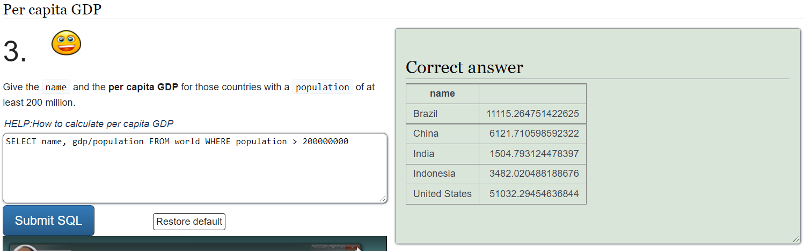

<h1> h2 </h1>

<h2> x) Read & sum</h2>

<h3> 
OWASP: OWASP 10 2021
</h3>

<h4>
Security Misconfiguration
</h4>
<h6> Reference: https://owasp.org/Top10/A05_2021-Security_Misconfiguration/ </h6>

  
 - Security misconfigurations are placed 5th in the OWAPS Top 10 list
  
 - There is an increased risk factor because of the shift towards highly configurable software, which can have:
    - Missing security hardening of the application stack
    - Improperly configured permissions on cloud services
    - Unnecessary features enabled 
    - Use or include the existence of default accounts and passwords that are enabled and unchanged
    - Incorrect error handling that exposes the software used or informative error messages to users
    - Missing the latest security features
    - Use of values in the applications servers or frameworks that aren't secure
    - Out of date software
  
  - For prevention, it is important to have repeatable hardening processes that ensure the identical and possibly automated configuration of secure environments, minimal installations with only necessary features or components, a way to verify the effectiveness of the configurations that were made, and update permissions and configurations based on security notes or new patches

<h4> 
Vulnerable and Outdated Components
</h4>
<h6> Reference: https://owasp.org/Top10/A06_2021-Vulnerable_and_Outdated_Components/ </h6>

  
 - Vulnerable and Outdated components are placed 6th in the OWAPS Top 10 list
  
 - There is a higher chance of being vulnerable if the component versions, dependencies, or nested components used are unknown, the software is out of date or unsupported, there is a lack of keeping up with new information, not upgrading the platform, frameworks, and dependencies regularly, or not performing tests for compatibility of updated libraries

<h4> 
Injection
</h4>
<h6> Reference: https://owasp.org/Top10/A03_2021-Injection/ </h6>

  
 - A code injection technique used to modify or retrieve data from SQL databases by sending statements that are not validated, filtered, or sanitized by the server or application.
  
 - Common injection targets are SQL, NoSQL, OS command, Object Relational Mapping (ORM), LDAP, and Expression Language (EL) or Object Graph Navigation Library (OGNL)
  
 - Prevention requires keeping data separate from commands and queries, as well as automated testing of all parameters, headers, URL, cookies, JSON, SOAP, and XML data inputs by using server-side input validation, API's that avoid the use of interpreters, limiting the amount of data that can be requested or other
  
 - Application security testing tools like static (SAST), dynamic (DAST), and interactive (IAST) can be used in the CI/CD pipeline to identify flaws before they are deployed

<h3> 
Darknet Diaries - Episode 103: Cloud Hopper
</h3>
<h6> Reference: https://darknetdiaries.com/episode/103/ </h6>

  
 - Fabio Viggiani, an incident responder, threat analyst and part of Truesec, a company that simulates attacks on systems as well as analyzes attacks made by threat actors, talks about a time when he was requested by the Swedish Security Service, a government agency in Sweden that investigates espionage and threats against national security, to take a look at a company's server that was in contact with a known threat actor's command and control server

 - The threat actor compromised the credentials and server by using Mimikatz and DLL side-loading malware and left a note for the expected forensic investigator
  
 - At first, the server was used to scan the US Department of Defense's server for open file-sharing connections without success, but didn't continue further until a couple of weeks later, which indicated that the company wasn't the initial target and the threat actor was possibly a nation-state actor
  
 - It turns out the MSP that the company used to outsource the infrastructure from was compromised as well, as the threat actor was discovered to be a Chinese advanced persistent threat that had some success in compromising data from the United States Department of Defense via its connections with other business-related companies

<h3> 
CVE-2022-1096 Chrome Zero-Day
</h3>
<h6> Reference:  
https://chromereleases.googleblog.com/2022/03/stable-channel-update-for-desktop_25.html   
https://www.youtube.com/watch?v=j-kvFJOpajU</h6>

  
A zero-day vulnerability that affects 2 billion users of Chromium-based browsers is rated by Google as a threat level of "high" and allows a threat actor to remotely trick browsers like Google Chrome to run malicious code.
 
Due to the high severity of the vulnerability, Google released a blog post mentioning an update to a patch that had been released, but to this date they didn't share details of the bug until a large majority of users would update to a newer version.
  
What we know: It is a type 'Confusion' vulnerability in V8, a JavaScript engine that is used by Chromium-based browsers, which can be exploited by threat actors through a logical bug that can result in a confusion between object types.

<h2> a) Sequel. SQLZoo </h2>

<h3> 0 SELECT Basics </h3>
<h6> Reference: https://sqlzoo.net/wiki/SELECT_basics & 
                https://www.w3schools.com/sql/</h6>

  - SQLZoo 0 introduces the basic SQL SELECT statements

  - Every question should be simple and not require any special instruction, but if you do need support, I advise you to check out w3schools to rehearse!
  
  - The question number and corresponding solution can be found in every screenshot       provided below

<h3> 2 SELECT from World </h3>
<h6> Reference: https://sqlzoo.net/wiki/SELECT_from_WORLD_Tutorial </h6>

  - SQLZoo 2 uses the earlier acquired knowledge of SQL SELECT statement in a slightly more advanced way

  - The only issue I stumbled upon was Number 11 with selecting the name and capital that have the same length of characters. The result is correct, but I didn't receive a "Correct result" display. The issue may stem from the host switching to Microsoft SQL Server and using LEN() instead of LENGTH(), which doesn't approve the solution due to the missing statement.
  
  - The question number and corresponding solution can be found in every screenshot       provided below

<h2> b) Injected. Solve WebGoat </h2>
<h6> Reference: https://github.com/WebGoat/WebGoat </h6>

<h3> A1 Injection </h3>

<h4>
Number 2 - SQL
</h4>

  - To retrieve data of the employee use: 
    - SELECT department FROM Employees WHERE first_name = 'Bob'

<h4>
Number 3 - Data Manipulation Language (DML)
</h4>
  
  - DML is used to manipulate data or request a set of records from the database by using SQL statements like SELECT, INSERT, UPDATE, or other
  
  - To change the department of the employee use: 
    - UPDATE Employees SET department = 'Sales' WHERE first_name = 'Tobi' AND last_name = 'Barnett'

<h4>
Number 4 - Data Definition Language (DDL)
</h4>
  
  - DDL is used to define, alter or delete data structures by using SQL statements like CREATE, ALTER or DROP

  - To modify the table use: 
    - ALTER TABLE Employees ADD phone VARCHAR(20)

<h4>
Number 5 - Data Control Language (DCL)
</h4>
  
  - DCL is used to create privileges to allow access to, or manipulate databases by using SQL statements like GRANT or REVOKE

  - To grant rights to alter the table use: 
    - GRANT ALTER TABLE TO UnauthorizedUser

<h4>
Number 9 - String SQL injection
</h4>
  
  - SQL injection is accomplished by inserting malicious code through the SQL query input from the client to the application

  - To exploit the concatenated strings in the query use: 
    - ' OR '1' = '1

<h4>
Number 10 - Numeric SQL injection
</h4>

  - To exploit the concatenated number in the query use: 
    - Login_Count: 1 (or any number) 
    - User_Id: '123' OR '1' = '1'

<h4>
Number 11 - Compromising confidentiality with String SQL injection
</h4>

  - Compromise the data by exploiting concatenated strings in the query using: 
    - Employee Name: ' OR 1=1 --
    - TAN: 3SL99A

<h4>
Number 12 - Compromising integrity with Query chaining
</h4>
  
  - Query chaining requires you to append one or more queries by using the metacharacter ; to mark the end of an implemented query and start another
 
  - Compromise the data by exploiting concatenated strings in the query using: 
    - Employee Name: '; UPDATE employees SET salary = 999999 WHERE userid = 37648
    - TAN: 3SL99A

<h4>
Number 13 - Compromising availability
</h4>
 
  - To compromise availability of the data use: 
    - '; DROP TABLE access_log; --

<h2> Additions in the future </h2>

m) Voluntary bonus: Pick your tasks from SQLZoo 1, 3-9.

n) Voluntary difficult bonus: WebGoat: SQL Injection (advanced).

o) Voluntary difficult bonus: Install a relational database, show CRUD operations using SQL

q) Voluntary difficult bonus: Demonstrate aggregate functions (SUM, COUNT) with your own data you created in the previous step.

p) Voluntary difficult bonus: Install a practice target for SQL injections, exploit it.

r) Voluntary difficult bonus: Demonstrate JOIN with your own database
