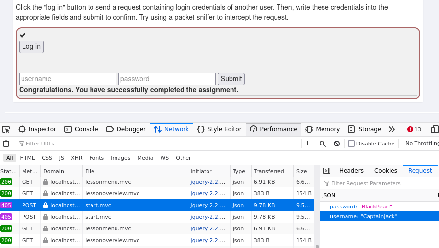
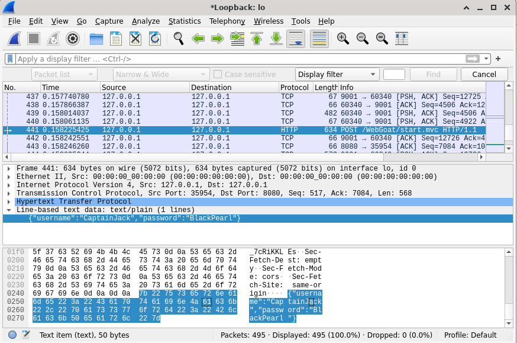
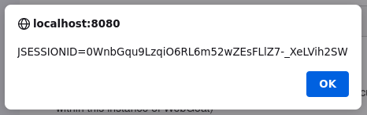
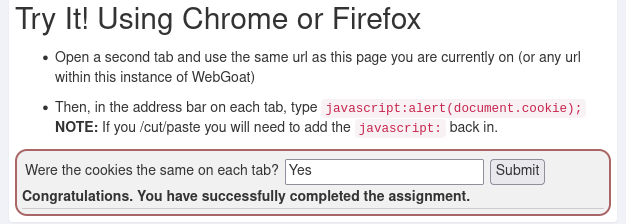
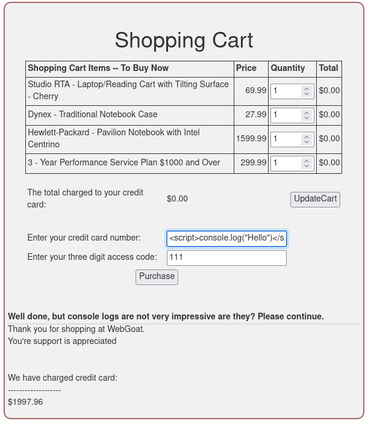

<h1> h3 </h1>
<h6> Reference: https://terokarvinen.com/2022/data-security-ict4tf022-3009/#h3 </h6>

<h2> x) Read & sum</h2>

<h3> 
Mitre 2022: ATT&CK Enterprise Matrix
</h3>
<h6> Reference: https://attack.mitre.org/matrices/enterprise/ </h6>

  
  - Reconnaissance
    - collecting information that can be used to plan a future attack
    - <b> Search Victim-Owned Websites </b> is a technique used by a threat actor to         search websites that are owned by a victim for details such as names, contact         information, location or other.
  - Resource Development
    - creating, purchasing, or stealing resources that are used for the attack
    - <b> Acquire Infrastructure </b> is a technique used to buy, lease or rent             infrastructure to host domains, DNS servers, Virtual Private Servers, botnets or       other.
  - Initial Access
    - trying to get access to a victims network
    - <b> Phishing </b> is a technique used to trick the victim into executing               malicious attachments or opening links within phishing messages to enable access       to the victims system.
  - Execution
    - running malicious code on local or remote systems
    - <b> User Execution </b> is a technique used that relies on the victim to perform       actions like clicking a link or file through social engineering in order to run       malicious code on their system.
  - Persistence
    - trying to maintain access to the victims system throughout restarts, different         user accounts, or other interruptions
    - <b> Boot or Logon Initialization Scripts </b> is a technique where the attacker       uses scripts that automatically execute while starting or logging into the             system to maintain access.
  - Privilege Escalation
    - gaining elevated permissions within the network or system to continue the             operation
    - <b> Domain Policy Modification </b> is a technique where the attacker modifies       the configuration settings of a domain to receive privileges in domain                 environments.
  - Defense Evasion
    - trying to avoid detection 
    - <b> Modifying Registry </b> is a technique used to hide configuration                 information within registry keys.
  - Credential Access
    - stealing credentials such as account names and password of the victim
    - <b> Credentials from Password Stores </b> is a technique where the attacker               searches for common password storage locations like keychains, web browsers,           password managers, or others to gather user credentials.
  - Discovery
    - gaining knowledge about the environment of the targeted system or network
    - <b> Browser Bookmark Discovery </b> is a technique used to look for browser               bookmarks to reveal personal information about the compromised user.
  - Lateral Movement
    - manuevering through the targeted system to perform the objective
    - <b> Software Deployment Tools </b> are third-party software suites that are           installed on an enterprise network for administration, monitoring, or other           purposes and are used by attackers to move through the system.
  - Collection
    - gathering data that is of interest to the objective
    - <b> Clipboard data </b> is data that is stored in the clipboard of the target system, where the user copies information within or between applications. It is           commonly collected to steal password details or general information about what the user is up to.
  - Command and Control
    - communication between the attacker and the targeted system to control its environment
    - <b> Non-Standard Port </b> is a technique used to communicate with the target system using a protocol and port paring that are typically not used. An             attacker may make changes to the standard port used by a protocol to bypass filtering or confuse the analysis of network data.
  - Exfiltration
    - trying to steal data from the target
    - <b> Exfiltration Over C2 Channel </b> is a way used by an attacker to transfer data over an existing command and control channel connection with the target             system. The data is encoded into the normal communications channel using the same protocol as command and control communications.
  - Impact
    - manipulating business and operational processes, interrupting availability, or destroying the target system or data
    - <b> Account Access Removal </b> is used to interrupt the availability of system and network resources by deleting, locking, or manipulating credentials of the         accounts of users.

  
  - <b> Techniques </b> describe how an adversary achieves a tactical goal by performing an action
    - Example: The attacker dumps credentials to attain credential access.
  
  - <b>Subtechniques </b> describe in higher detail a way of how an adversary achieves a tactial goal. They can be grouped with other subtechniques as a Technique
  
  - <b> Tactics </b> represent the why or the reason for performing an action of an technique or subtechnique
    - Example: The attacker wants to attain credential access continue his objective of breaking into a target system.
  
  - <b> Software </b> stands for custom or commercial code, operating system utilities, open-source software, or other tools used by groups to conduct activities that are described in ATT&CK.
  
  - <b> Groups </b> are a collection of related intrusion activities that are known by one or multiple common names in the security community. 
    - Example: The "Lazarus Group", a North Korean state-sponsored cyber threat group that has been active since at least 2009 and uses malware that is connected to         other reported campaigns like Operation Flame, Operation 1Mission, Operation Troy, DarkSeoul, and Ten Days of Rain.

<h3> 
OWASP - Cross Site Scripting (XSS)
</h3>
<h6> Reference: https://owasp.org/www-community/attacks/xss/ </h6>

  
 - A type of injection attack that is used to send malicious code in the form of a script through user input of a website or application to the target server
  
 - If the website doesn't validate or encode user inputs, the attacker can execute the script without being caught as the script will look like it comes from a trusted source
  
 - The script may allow access to cookies, session tokens, or other sensitive information that a browser session stores
  
 - Stored XSS (Persistent or Type-I XSS) are attacks, where the injected script is permanently stored on the target servers
 
 - Reflected XSS (Non-Persistent or Type-II XSS) are attacks where the injected script is reflected or redirected to or by the attacker off the web server in the form of an error message, search result, or other responses shown on the web application

<h2> y) Short story </h2>

<h3> Cross Site Scripting</h3>
<h6> Reference: https://owasp.org/www-community/attacks/xss/ Example 1 - Cookie Grabber</h6>

Toby is a forum administrator on a very popular website. One day, he comes across a new post made by a user called Philx, who is fairly new to the website. In the post, Philx talks about the owner of the website, who has repeatedly been in controversy. The post gathered a lot of attention from the other users and has resulted in the spread of this information. Toby recognizes that this may lead to the downfall of the website and decides to delete the post to sweep it under the rug and bans Philx. The next day, Philx notices this and can't believe it. His anger grows and he decides that he wants revenge. Philx has some knowledge of programming and decides to look for attack vectors on Toby's website. He quickly realizes that the website doesn't sanitize posts or messages sent on the website, which allows Philx to use an XSS attack where he can send malicious code in the form of a script. Philx doesn't want to harm other members of the forum and decides to message Toby privately. He sends a script to Toby that executes code, which saves the session cookie of the message's reader in a file and redirects it to the attacker, Philx. This will allow Philx to automatically be logged into Toby's administrator account through the saved login state. An unsuspecting Toby opens the message and doesn't realize what just happened. Philx has access to his account and continues his devious plan to harm Toby.

<h2> a & b) Webgoat </h2>
<h6> Reference: https://github.com/WebGoat/WebGoat </h6>

<h3> A3 Sensitive data exposure </h3>

<h4>
Number 2 - Insecure login
</h4>
  <h5> Simple route </h5>
  
  - Use the developer tools by pressing F12 and navigate to the network tab
  - As instructed, press the Login button to send the POST request of another users' credentials and start looking for it in the network tab
  - Head to the Request tab and locate the username and password that were sent
  - Note: It is more realistic to use a packet sniffer such as Wireshark to capture the unencrypted POST request that is sent by the victim.

 <h5> Better route </h5>
 <h6> Reference: https://www.linuxcapable.com/how-to-install-wireshark-on-debian-11-bullseye/ & https://www.wireshark.org</h6>

  - To install Wireshark on Debian use:
    - sudo apt install wireshark
  - Select 'Yes' if prompted to allow non-superusers to capture packets
  - If you accidentally pressed 'No' use the command below and restart Debian
    - sudo dpkg-reconfigure wireshark-common
  - To open the GUI type 'sudo wireshark' in the command line
  - Select 'Loopback: Io' and press the shark fin on the top left to start capturing packets
  - Press the Login button to send the POST request, go back to Wireshark and press the red square to stop capturing packets
  - Search for HTTP protocols with the information POST and select it
  - Scroll down to see the solution

<h3> A7 Cross Site Scripting </h3>

<h4>
Number 2 - What is XSS
</h4>
  
  - To expose the session cookie open the Developer tools by pressing F12 and type in the console: 
    - javascript:alert(document.cookie);
  - The session ID should be the same in each tab!

<h4>
Number 7 - Reflected XSS
</h4>

  - To determine which field is vulnerable use: 
    - 
  - If the script executes upon clicking 'Purchase' you found the field and could continue with a reflected XSS attack

