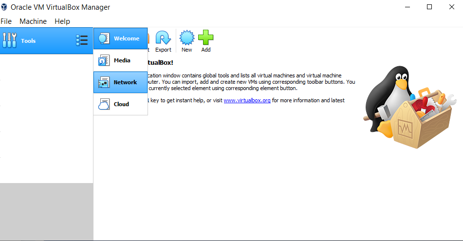
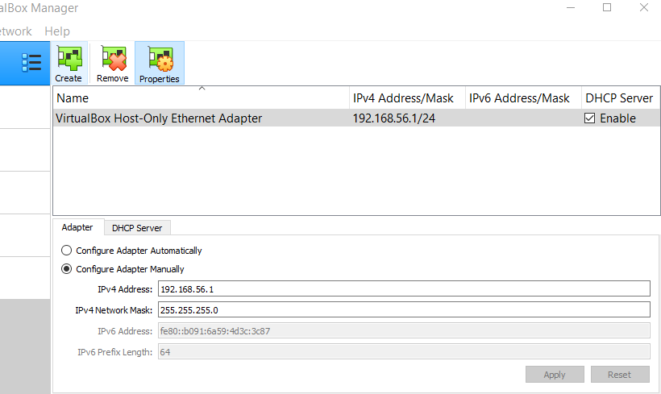
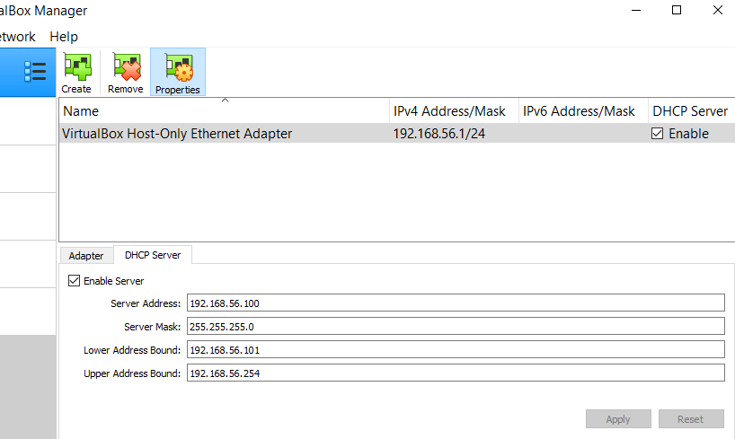
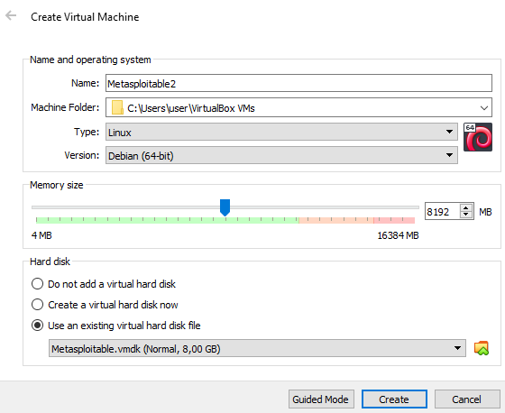
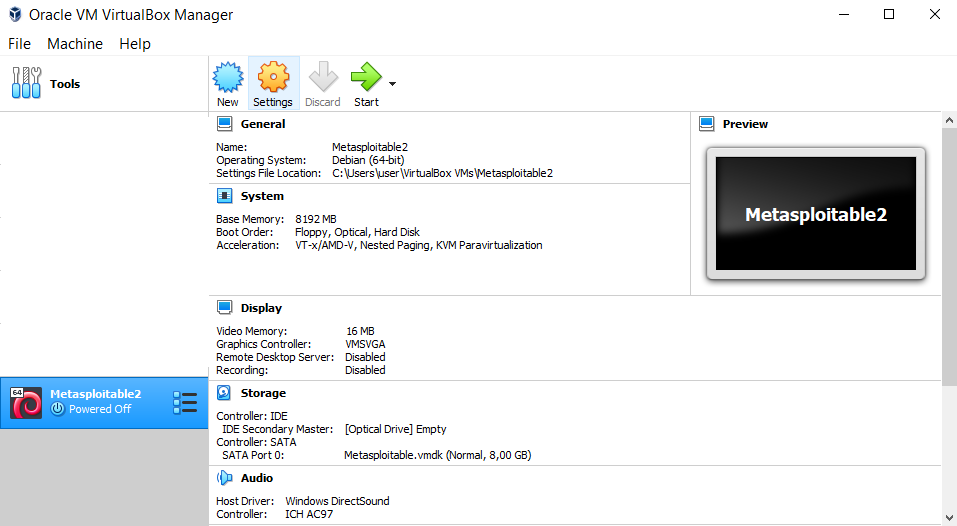
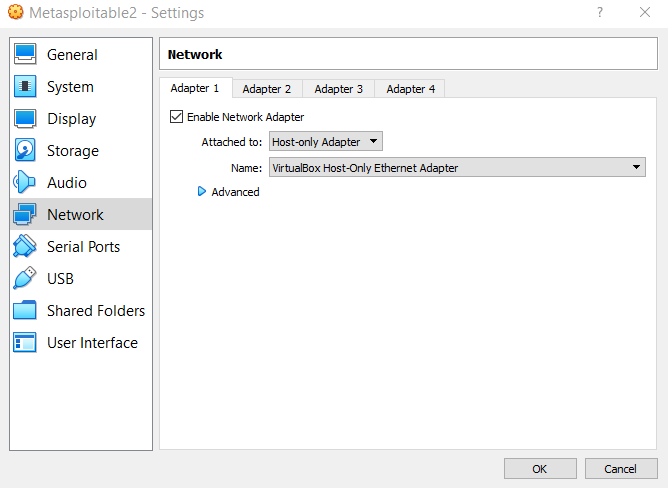
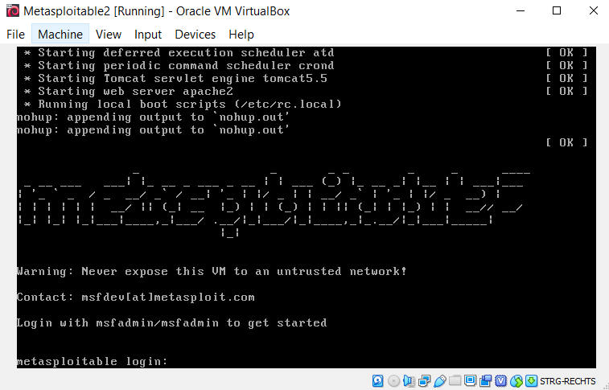
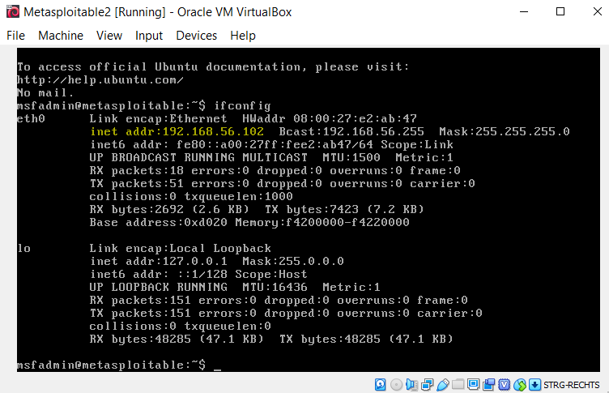
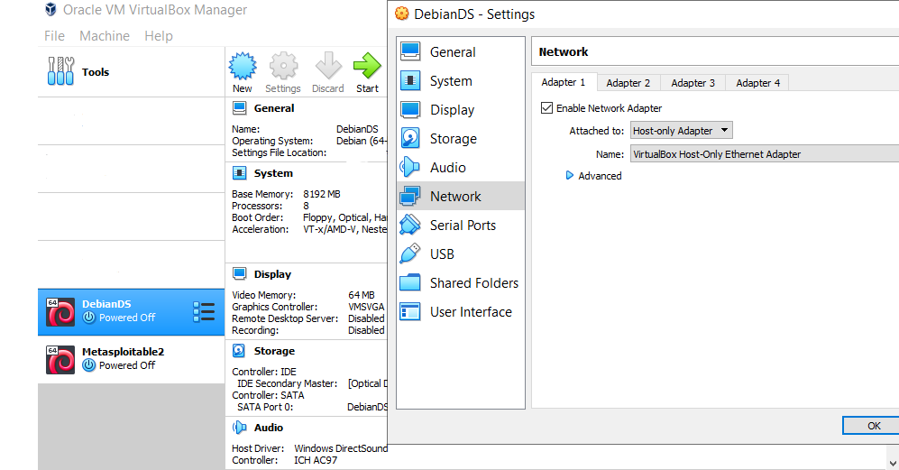

<h1> h4 </h1>
<h6> Reference: https://terokarvinen.com/2022/data-security-ict4tf022-3009/#h4 </h6>

<h2> x) Read & sum</h2>

<h3> 
€ Santos et al: The Art of Hacking (Video Collection)
</h3>
<h6> Reference: https://www.oreilly.com/videos/the-art-of/9780135767849/ </h6>

<h4> Passive Reconnoissance: 3.0 - 3.4 </h4>
<h6> Reference: https://www.oreilly.com/videos/the-art-of/9780135767849/9780135767849-SPTT_03_00/ </h6>

  - Researching publicly available information without sending information to the target and tripping off alarms
  
  - Don't skip this phase because you could miss out on important information or vulnerabilities, target the wrong systems or alert the target
  
  - You can find host and port information through techniques such as:
    - Search engines (Google dorks)
    - Certificate Transparency (finding issued certificates)
    - Guessing hostnames (using nslookup to determine if the target exists)
    - Regional Internet Registries (IP lookup, subnets, contact details)
    - Netcraft searches
    - Shodan.io or Censys.io searches (to search scan results of systems that are       reachable online)
    
  - You can find information through files belonging to organizations by using Search Engines (Google Dorks for file types like PDF, XLSX, TXT or other) and metadata (find usernames or software)
    
  - You can find names, passwords, and other sensitive information that belong to an organization by using data breaches, paste sites, Google Hacking Database or other

<h4> Active Reconnaissance: 4.0 - 4.3 </h4>
<h6> Reference: https://www.oreilly.com/videos/the-art-of/9780135767849/9780135767849-SPTT_04_00/ </h6>

  - Actively researching information about the target by sending information that could potentially set off alarms using methods such as:
    - Port scanning (confirm open ports) with tools like Nmap, Masscan, UDPProtoScanner
    - Web Service Review (prioritizing target web applications) with EyeWitness
    - Vulnerability scanning (determine external and internal vulnerabilities)
  

<h3> 
Lyon 2009: Nmap Network Scanning: Chapter 15 - Port Scanning Basics
</h3>
<h6> Reference: https://nmap.org/book/man-port-scanning-basics.html </h6>

 - The port scanner Nmap can be used with the command: nmap {target IP}
 
 - Nmap recognizes six different types of port states:
    - OPEN: Application is accepting TCP connections, UDP datagrams, or SCTP associations
    - CLOSED: Port is accessible, but no application is listening to it
    - FILTERED: Packet filtering (by firewall, router rules, or other) prevents the detection of an OPEN or CLOSED port and require alternative scan types to be used
    - OPEN|FILTERED: Unable to determine OPEN or FILTERED port state as the OPEN port doesn't respond because of missing functions or packet filtering
    - CLOSED|FILTERED: Unable to determine CLOSED or FILTERED port state

<h2> a) My networks </h2>

<h3> Adding a new vboxnet internal network to VirtualBox</h3>

  
  - Click on the bullet list next to tools and select Network
  
  - Press 'Create' to create a new network
  
  - Select the new network and press properties
  
  - Make sure that the DHCP Server is enabled and the network is configured correctly / not using an already existing IPv4 address

<h5> Process </h5>

<h2> b) Punchbag </h2>

<h3> Installing the Metasploitable 2 practice target </h3>
<h6> Reference: http://downloads.metasploit.com/data/metasploitable/metasploitable-linux-2.0.0.zip</h6>

  
  - Download the Metasploitable 2 from RAPID7 or Sourceforge
  
  - Extract the Metasploitable.vmdk file from the downloaded ZIP to your desktop
  
  - Open VirtualBox and select New
  
  - Give the VM a name, select type 'Linux', select version 'Debian (64-bit)', and select 'Use an existing virtual hard disk file', where you choose the Metasploitable.vmdk file
  

<h3> Connecting it to the new virtual network </h3>

  
  - Select the Metasploitable2 VM and go to settings
  
  - Navigate to Network and select 'Attached to:' as 'Host-Only Adapter'
  
  - Make sure that the name of the adapter is the same as the one that you created earlier

<h5> Process </h5>

  

<h3> Logging into Metasploitable 2 and finding out its IP address </h3>
<h6> Reference: https://docs.rapid7.com/metasploit/metasploitable-2/ </h6>

  
  - Start the Metasploitable2 VM and login using: 
    - Name: msfadmin
    - Password: msfadmin
  
  - To determine the IP address use 'ifconfig' and look at the inet address of eth0

<h5> Process </h5>

<h2> c) Hero arrives </h2>

<h3> Connecting Debian 11 Bullseye to the same network </h3>

  
  - Just like earlier select the the Debian VM and go to settings
  
  - Navigate to Network and select 'Attached to:' as 'Host-Only Adapter'
  
  - Make sure that the name of the adapter is the same as the one that you created earlier
  
  - Both virtual machines should now be part of the same network and reachable

<h2> d) Hello sploitable! </h2>

<h3> Accessing Metasploitable 2 from Debian 11 Bullseye </h3>
<h6> Reference: ... </h6>

  
  - ...

<h2> e) Explain 2 Metasploitable </h2>

<h3> Port scan Metasploitable 2 and analyze </h3>
<h6> Reference: ... </h6>

  
  - ...

<h2> Additions in the future </h2>

g) Voluntary: Scanalyses. Port scan Metasploitable 2 and analyze the results

h) Voluntary: It's raining shells. Break into Metasploitable 2 using multiple methods
