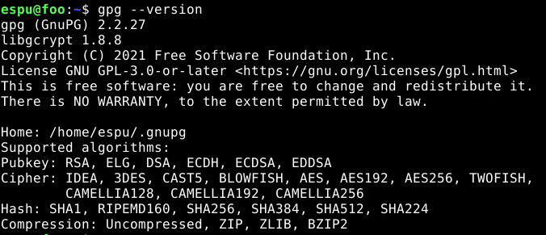
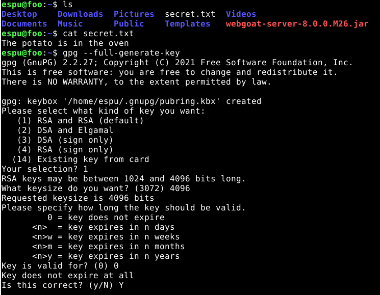
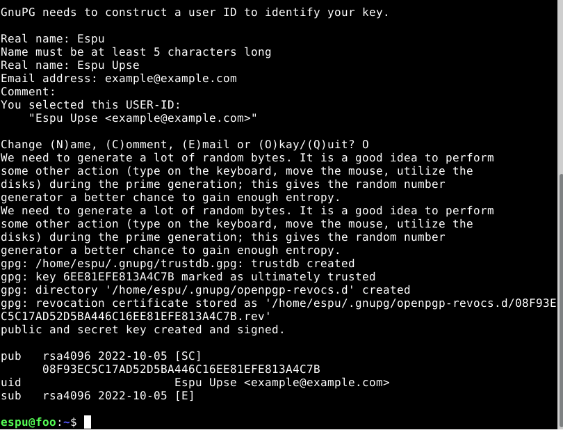
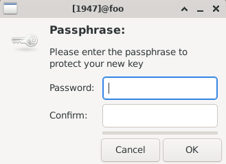
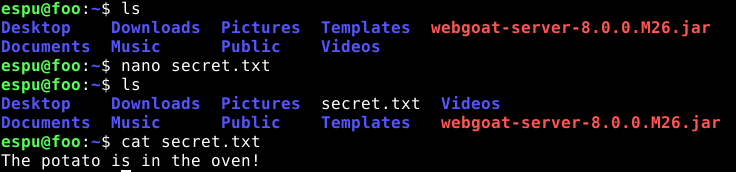
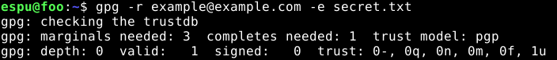
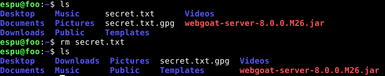
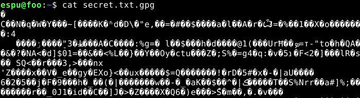
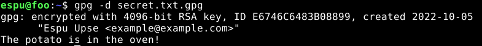

<h1> h5 </h1>
<h6> Reference: https://terokarvinen.com/2022/data-security-ict4tf022-3009/#h5 </h6>

<h2> x) Read & sum</h2>

<h3> Schneier 2015: Applied Cryptography </h3>
<h6> Reference: https://learning.oreilly.com/library/view/applied-cryptography-protocols/9781119096726/08_chap01.html#chap01-sec001 </h6>

<h4> Chapter 1: Foundations </h4>

  - When a sender transmits a message to a receiver they should use encryption, a process of disguising the message to hide its substance
  - The message is transformed/encrypted from plaintext to ciphertext by the sender and decrypted to the original plaintext by the receiver
  - A cipher, a cryptographic algorithm, is a mathematical function used for the encryption and decryption
  - Cryptography = the art and science of keeping messages secure and allows for:
    - Authentication = ensuring who sent the message
    - Integrity = hindering any type of modification throughout the transmission
    - Nonrepudiation = assurance that the sender sent the message
  - Cryptanalysis = the art and science of breaking ciphertext by accessing the plaintext message without access to the key
  - Restricted algorithms base their security on keeping the details of how an algorithm works a secret
  - Modern cryptography uses keys instead; allowing for published and analyzed algorithms
  - Symmetric Algorithms such as Stream Algorithms or Block Algorithms allow for the encryption key to be calculated from the decryption key and the other way around. The encryption and decryption key are the same and the sender and receiver must agree on a secret key before starting to communicate with each other
  - Public-Key Algorithms, or Asymmetric Algorithms, use different keys for the encryption and decryption. One can't determine one key using the other. The encryption key used can be public, but the receiver is the only one that can decrypt the message.
  - General types of cryptanalytic attacks are:
    - Ciphertext-only attack, where the cryptanalyst has access to multiple ciphertexts that use the same encryption, and tries to recover the plaintext or key.
    - Known-plaintext attack, where the cryptanalyst has access to multiple encrypted messages and some of the messages in plaintext and tries to deduce the key used for the encryption and decryption.
    - Chosen-plaintext attack, which is similar to the known-plaintext attack, but the cryptanalyst can choose blocks of plaintext that support his search for the key
    - Adaptive-chosen-plaintext attack, which is a special version of the chosen-   plaintext attack where the cryptanalyst chooses blocks of plaintext based on the result of earlier deductions
  - Algorithms offer different degrees of security; it depends on how hard they are to break
    - Cost to break algorithm > Value of encrypted data
    - Time required to break algorithm > Time encrypted data must remain a secret
    - Amount of encrypted data with a single key < Amount of data necessary to break algorithm
    - Value of data decreases over time; Value of the data < cost to break the security
  - Lars Knudsen classification of different categories of breaking an algorithm:
    - Total break = cryptanalyst determines the key
    - Global deduction = cryptanalyst finds an alternate algorithm
    - Instance deduction = cryptanalyst finds the plaintext of an intercepted ciphertext
    - Information deduction = cryptanalyst gains information about parts of the key or plaintext
    - An algorithm is considered computationally secure or strong if it currently or in the future can't be broken with available resources
  - To measure the complexity of an attack one uses these factors:
    - Data complexity = amount of data needed as input to the attack
    - Processing complexity = time needed to perform the attack (also called work factor)
    - Storage requirements = amount of memory needed to perform the attack
  - Steganography = concealing the existence of secret messages in other messages
  - Substitution cipher = method of encryption where each character of the plaintext is substituted with a corresponding character in the ciphertext. To reveal the plaintext the receiver must perform an inverse substitution.
  - Transposition cipher = method of encryption where plaintext characters are shifted in a regular pattern to form ciphertext

<h2> a) Presentation material </h2>
<h6> Reference:  
  https://keepassxc.org
  
  [Password_managers.pdf](presentation/Password_managers.pdf) (Includes sources)
</h6>
  
<h3> Password managers</h3>

  
Key points:
  
  - What is a password manager?
  - Benefits
  - Possible issues
  - Cloud-based or offline?
  - Who is it for?
  - Introduction to and showcase of KeePassXC
  
Synopsis:
  
A presentation about what a password manager is, the benefits and possible issues that one may face, if cloud-based solutions are worth it, who it is for and what one should ask themselves when deciding on using a password manager. Additionally, I will provide a brief practical showcase of one particular password manager, KeePassXC.
  

<h2> b) Encrypt and decrypt </h2>

<h3> File Encryption with GPG </h3>
<h6> Reference: 
  https://gnupg.org  
  https://www.youtube.com/watch?v=DMGIlj7u7Eo  
  https://linuxconfig.org/how-to-encrypt-and-decrypt-individual-files-with-gpg</h6>

  
<h4> Checking on GPG </h4>
  
  - To check wether GnuPG is installed use either
  
  > gpg --version
  
  OR
  
  > man gpg
  
  
  
  - If GnPG or GPG isn't already installed use the following command:
  
  > sudo apt install gnupg
  

<h4> Generating our key pair</h4>

  - To be able to encrypt and decrypt files we have to generate a key pair using the command:
  
  > gpg --full-generate-key
  
  - Next we will have to setup our key by choosing:
    - What type of key we use: 
    > 1 (default RSA and RSA)
    
    - Key size (the larger the better)
    > 4096

    - Key validity (should be limited, but in our test case we can choose a key that doesn't expire)
    > 0  
  

  
  - Additionally, we must provide an identity that is attached to this key by entering:
    - Real name (or fictional name)
    - E-Mail address
    - Voluntary comment
    - Passphrase to secure access
  

  

  - Finally, the program will generate a signed public and private key, which you can locate using:
  
    - Public key (used to encrypt and sign messages with; can be share)
    > gpg --list-keys

    - Private key (used to decrypt messages that were creating using the corresponding public key; shouldn't be shared)
    > gpg --list-secret-keys

  - In practice, you share the public key with another individual, who will encrypt and send the message to you. Then, you will be able to decrypt the encrypted    message using the corresponding private key and the passphrase that was set.

<h4> Creating the message </h4>
  
  - Write a message to a text file by typing:
  
  > nano secret.txt
  
  - Add your message to the text file and save

  - To make sure we successfully created our message we use:
  
  > ls
 
  > cat secret.txt

  
  

<h4> Encrypting the message </h4>
  
  - To encrypt the message we must specify the recipient (-r {email address}), the encryption (-e, default selection asymmetric), and the file (secret.txt):
  
  > gpg -r example@example.com -e secret.txt

  
  
  - To get rid of the unencrypted message and hide the content of the file use:
  
  > rm {file name}
  
  
  
  - Now, the only file left is the encrypted file that ends with .gpg
  
  

<h4> Decrypting the message </h4>
  
  - To decrypt the encrypted message we must specify the decryption (-d, used for both asymmetric and symmetric) and the file (secret.txt.gpg):
  
  > gpg -d secret.txt.gpg

  
  

