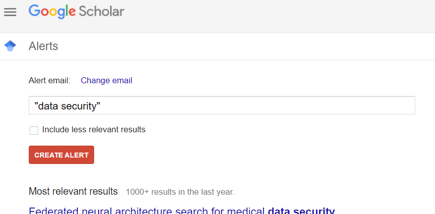
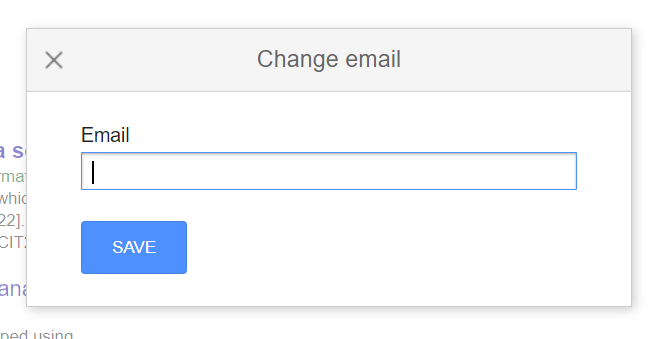
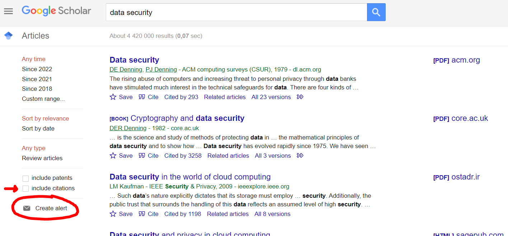

<h1> h7 </h1>
<h6> Reference: https://terokarvinen.com/2022/data-security-ict4tf022-3009/#h7 </h6>

<h2> w) Read & summarize </h2>

<h3> Karvinen 2020: Find Academic Sources </h3>
<h6> Reference:  
  https://terokarvinen.com/2021/find-academic-sources/  
  https://scholar.google.com 
  https://jfp.csc.fi  
  https://www.connectedpapers.com  
  
  

</h6>

  
  - The author of the source, Tero Karvinen, provides instructions and advise on where and how to find academic sources that can be used for thesis work
  
  - Suggests to start by using <a href="https://scholar.google.com">Google Scholar</a>, a web search engine that searches specifically for academic sources such as articles, theses, books, and abstracts
  
  - Every result that catches your interest should have a Journal <a href="https://jfp.csc.fi">JUFO</a> level that is higher than 0 to verify that it has been peer reviewed
  
  - And one can find related articles with the help of <a href="https://www.connectedpapers.com">ConnectedPapers</a>, a tool that helps researchers and applied scientists to find and explore topic-relevant papers
  
  - According to the author, a good source for academic work should be published in a reputable location by a known author and peer reviewed using the JUFO rating
  
  - News paper articles, manual for programs, white papers, advertisements, or even popular books often times aren't peer reviewed academic sources

  
  

<h2> x) Journal. Read and summarize a peer reviewed scholary journal article </h2>

<h3> Exposing digital forgeries from JPEG ghosts - Hany Farid</h3>
<h6> Reference:  
     https://ieeexplore.ieee.org/abstract/document/4773149  
     https://jfp.csc.fi/en/web/haku#!PublicationInformationView/id/57550
</h6>

  
  - <a href="https://jfp.csc.fi/en/web/haku#!PublicationInformationView/id/57550">JUFO</a> ID: 57550
  - JUFO level: 2
  
  - The journal was read from the beginning to the end, but requires a good understanding of photo processing, compression methods, and the use of mathematical formulas
  
<h5> Notes </h5>

  - Digital forensics uses techniques to detect cloning, splicing, resampling artifacts, color filter-array aberrations, disturbances of a camera’s sensor noise pattern, chromatic aberrations, and lighting inconsistencies
  - Many techniques used by forensic analysts are only applicable to images that are of higher quality in resolution with only little compression
  - The author presents another technique to detect tampering in low- to medium-quality images (e.g. insertion of another image that originated from a JPEG with different compression qualities)
  - The technique detects whether part of an image was compressed at a lower
quality than the saved JPEG quality of the entire image (JPEG Ghosts)
  - JPEG Ghosts are highly salient (i.e. noticeable, protruding)
  - They can be detected by comparing a set of images that were saved at a multitude of JPEG qualities and detecting spatially localized minima (the least assignable quantity, compression artifacts) in the difference between the image and its compressed counterpart
  - the comparison highlights the differences between the quantization (compression) that was used through the comparison of multiple pixels in grayscale and with the help of advanced calculations that determine the likelihood of altered pixels
  - An automatic detection algorithm could be put into place to automatically detect JPEG ghosts within a large number of images
  - Advantage of this technique: 
    - it is effective on low-quality images and can detect relatively small regions that have been altered
  - Disadvantage of this technique:
    -  it is only effective when the tampered region of pixels is of lower quality than the image into which it was inserted

  

<h2> y) Alert. Create a search that finds scientific articles in an area of security that interests you </h2>

<h3> Creating a search alert for a scientific article </h3>
<h6> Reference: https://scholar.google.com/ </h6>

  - <a href="https://scholar.google.com">Google Scholar</a> enables you to create and receive alert notifications via email for areas of interest based on relevant keywords
  
  - To create an alert notification:
    - Make sure to be logged into Google
    - Navigate to the homepage of Google Scholar
    - Click on the menu that is located on the top left of the page
    - Press the tab called Alerts
    - Input keywords that are of interest and keep "Include less relevant results" unchecked
    - Click on "Create Alert" to submit and receive alerts in the future
  
  - You can also create an alert while browsing Google Scholar; it will include the already searched keywords and you can use an email that is not related to Google
  - Possibly uncheck "Include citations" and "Include patents" to get more relevant search results

<h5> Process </h5>

